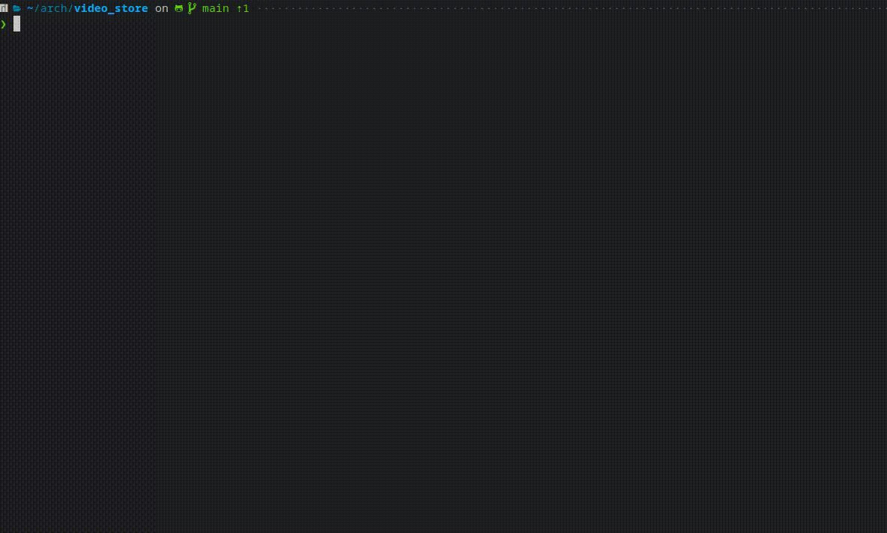

# Video Store

<br>

<div align="center">
 
</div>

***
## Description

This program was created as a complement work to get the marks of the subject Programming I in the Computer Science Course at UNIFAP

## Languages and Frameworks

* [C](https://en.wikipedia.org/wiki/C_programming_language)
* [CMake](https://cmake.org/cmake/help/latest/)
* [Minunity](https://github.com/siu/minunit)

## How to run?
* In your terminal type
  
 ```console
git clone https://github.com/gabrielfelipeassuncaodesouza/video_store
```
* Enter on the directory cloned and type `make` (you should have installed make and C compiler obviously).

* After creates the binary executable type `make run` to execute the program.
  
* To run the tests write `make test`

### ⚠️ Warning zone

* If you don't have installed make yet, here are some instructions to install it
* If you're using Windows just type `winget install GnuWin32.Make` on your terminal and add the bin directory to the path
* In Ubuntu and derivates type `sudo apt install make`
* In Arch and derivates type `sudo pacman -S cmake`
* In RedHat and derivates type `sudo dnf -y install make`
